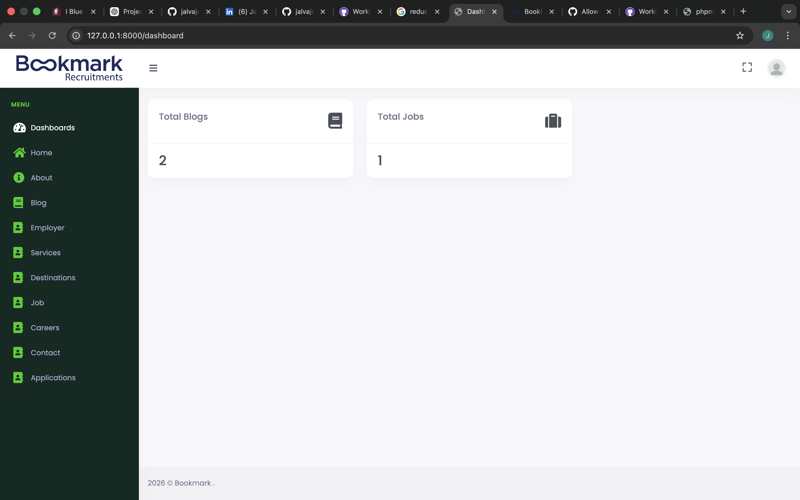
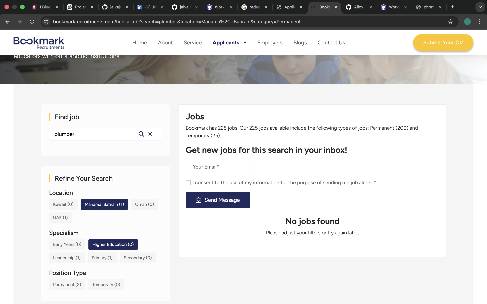
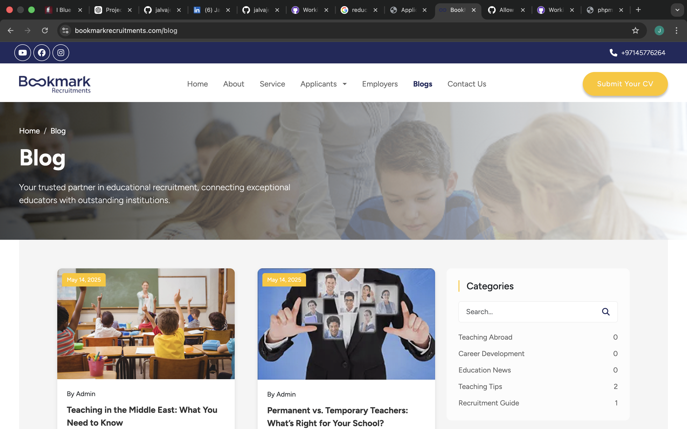
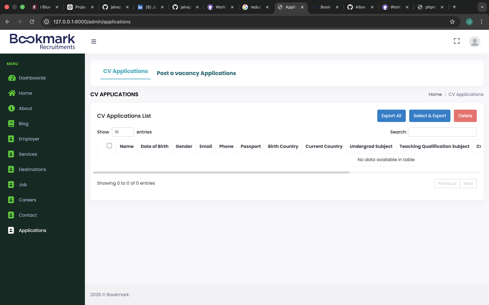
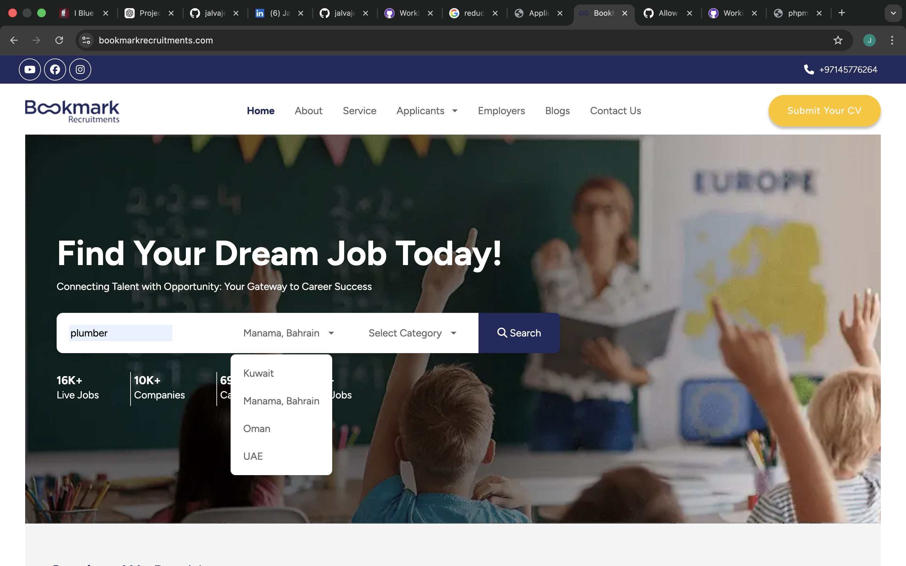
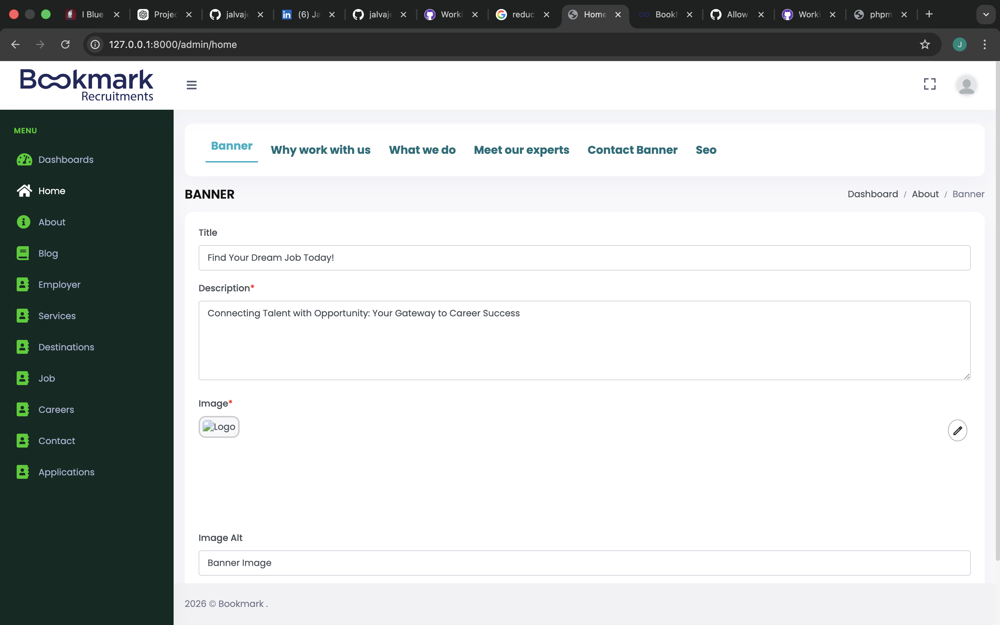

# 📌 Bookmark – Laravel CMS & Job Management System

## 🌐 Live Demo
https://bookmarkrecruitments.com/

---

## 📌 Short Description
Bookmark is a Laravel-based content management system where website sections such as home page, blog, About Us, and job listings are fully managed through a backend admin panel. It also includes job search and job application submission functionality.

---

## 🚀 Project Overview

This project demonstrates a dynamic backend-driven website where all major content is controlled through an admin dashboard instead of hardcoded frontend content.

It includes modules for managing blogs, job postings, job applications, and static pages like About Us and Home.

---

## ✨ Features

### 🧑‍💼 Admin Panel
- Manage website content from backend
- Add, edit, and delete blog posts
- Manage job listings
- View job applications submitted by users
- Update homepage and About Us content dynamically

### 📝 Blog Module
- Create and publish blog posts
- Edit and delete blog content
- Control visibility of posts

### 💼 Job Module
- Post job listings from admin panel
- Job search functionality for users
- Job application submission form
- View and manage applications in backend

### 🏠 Dynamic Pages
- Fully editable homepage sections
- About Us page managed via backend
- No hardcoded frontend content

---

## 🛠️ Tech Stack

- Laravel (PHP Framework)
- MySQL
- Blade Templates
- JavaScript / jQuery
- Bootstrap

---

## 📌 My Role

This project was developed as a practical full-stack Laravel implementation focusing on backend-driven content management.

My contributions include:
- Developing admin panel modules
- Implementing blog and job management system
- Building job application workflow
- Creating dynamic frontend rendering from backend data
- Handling deployment and bug fixes

---

## 📷 Screenshots

---

## 🔐 Test Credentials (if applicable)

Email: admin@example.com  
Password: password123

---

## 💡 Key Learnings

- Laravel MVC architecture in real project flow
- Dynamic content management system design
- CRUD operations across multiple modules
- Backend-to-frontend data binding
- Form handling and validation
- Project structuring and deployment

---

## 🔮 Future Improvements

- Email notifications for job applications
- Advanced search and filtering
- API integration for mobile apps
- UI/UX improvements

---

## 📌 Note

This project is a backend-focused implementation built for learning and practical experience in Laravel-based CMS and job management systems.
